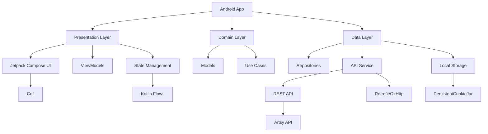
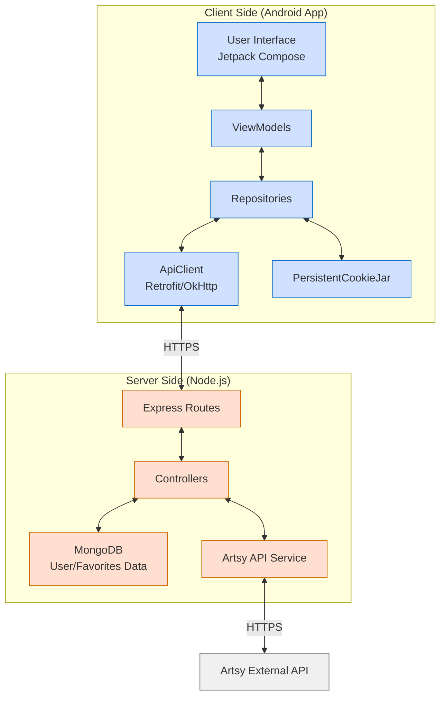

# Artist Search Android App

This is an Android application for searching and exploring artists and their artworks using the Artsy API. The app allows users to search for artists, view detailed information about them, browse their artworks, and save their favorite artists.


The Web portal can be reached on: https://csci571-hw5-nrocikay.wl.r.appspot.com/

Details about the back end can be found in this [repo](https://github.com/Omiikay/Artsy-Backend).

Details about the web front end can be found in this [repo](https://github.com/Omiikay/Artsy-Frontend).


## Technology Stack



## System Architecture



## Features

### Home Screen
- Display current date 
- View a list of favorite artists (when logged in)
- Navigate to Artsy website through the "Powered by Artsy" link

### Authentication
- User registration with email and password
- User login with email validation
- Persistent login with cookies
- User profile management
- Account deletion

### Artist Search
- Search artists by name with dynamic results
- Display artist search results in a card-based layout
- Add/remove artists to/from favorites list

### Artist Details
- View comprehensive artist information (name, nationality, birth/death years, biography)
- Browse artist's artworks
- Explore artwork categories
- Find similar artists (when logged in)

### Favorites Management
- View saved favorite artists
- Add/remove artists from favorites
- Display relative time when artists were added to favorites

### UI Features
- Material Design 3 components
- Responsive layouts
- Dark mode support
- Smooth animations and transitions
- Snackbar notifications for user actions

## Technologies Used

- **Language**: Kotlin
- **UI Framework**: Jetpack Compose
- **Architecture**: MVVM (Model-View-ViewModel)
- **Networking**: Retrofit, OkHttp
- **Image Loading**: Coil
- **Authentication**: JWT Tokens with PersistentCookieJar
- **State Management**: Kotlin Flows and StateFlow
- **Backend**: Node.js with Express (communicating with Artsy API)

## Architecture Overview

The app follows the MVVM (Model-View-ViewModel) architecture pattern with the following components:

### Data Layer
- **Models**: Data classes representing the domain entities
- **Repositories**: Classes that handle data operations
- **API Service**: Retrofit interface for network requests

### UI Layer
- **ViewModels**: Manage UI-related data and handle business logic
- **Screens**: Compose screens that make up the UI
- **Components**: Reusable Compose UI components

### Utils
- Helper classes and extension functions
- Authentication utilities
- Custom views and animations

## Project Structure

```
com.csci571.artsyapp/
├── ArtistSearchApplication.kt # This is the main application class for the Artsy app.
│ 
├── data/
│   ├── api/
│   │   ├── ApiClient.kt       # Retrofit client setup
│   │   └── ArtsyApi.kt        # API endpoints interface
│   ├── model/
│   │   ├── Models.kt          # Containing Artist data models, Artwork data models, Category data models, Favorite artist models, User authentication models
│   └── repository/
│       ├── ArtsyRepository.kt # Artist/artwork data operations
│       ├── AuthRepository.kt  # Authentication operations
│       └── FavoritesRepository.kt # Favorites operations
├── ui/
│   ├── components/
│   │   ├── ArtistCard.kt      # Reusable artist card component
│   │   ├── CategoryCarousel.kt # Artwork categories display
│   │   ├── SearchBar.kt       # Search input component
│   │   ├── MarkdownLinkText.kt# Process data link text in artwork descriptions
│   │   └── SnackbarHost.kt    # Global notification component
│   ├── screens/
│   │   ├── ArtistDetailScreen.kt # Artist details page
│   │   ├── HomeScreen.kt      # Home page
│   │   ├── LoginScreen.kt     # Login page
│   │   ├── MainActivity.kt    # App entry point & navigation
│   │   ├── RegisterScreen.kt  # Registration page
│   │   └── SearchResultScreen.kt # Search results page
│   ├── theme/
│   │   ├── Color.kt           # App colors
│   │   ├── Types.kt           # Text styling
│   │   └── Theme.kt           # App theming & styling
│   └── viewmodel/
│       ├── ArtistDetailViewModel.kt # Details screen logic
│       ├── AuthViewModel.kt   # Authentication logic
│       ├── FavoritesViewModel.kt # Favorites management
│       ├── SearchViewModel.kt # Search functionality
│       └── SnackbarViewModel.kt # Notification management
└── utils/
    ├── Constants.kt           # App-wide constants
    ├── PersistentCookieJar.kt # Cookie management for auth
    ├── Resource.kt            # API response wrapper
    └── Utils.kt               # Helper functions
```

## Installation

1. Clone the repository
2. Open the project in Android Studio
3. Update the `Constants.kt` file with your API base URL
4. Build and run the application on an emulator or physical device


## API Reference

The application communicates with a Node.js backend that interfaces with the Artsy API. The backend handles:

- Authentication with Artsy API
- User management (registration, login, etc.)
- Artist search and filtering
- Artwork retrieval
- Favorites management
